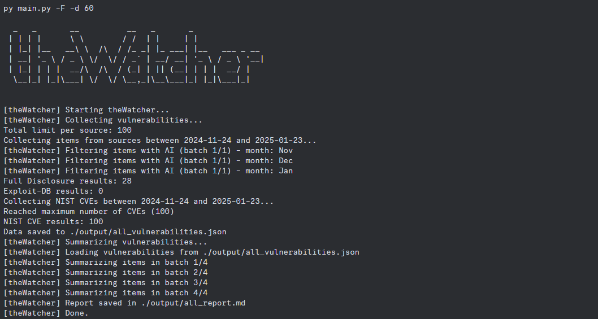

# theWatcher

<!-- <h1 align="center">
  
</h1> -->

theWatcher is a security vulnerability collection and analysis tool. It retrieves data from multiple sources, applies AI-based classification and summarization when possible, and generates concise reports.

## Features

- Collect vulnerabilities from:
  - Full Disclosure
  - Exploit-DB
  - NIST
- Summarize vulnerabilities using AI, grouping them by technology and highlighting trends
- Filter vulnerabilities by severity
- Limit the number of items collected from each source

## Prerequisites

- Python 3.7+  
- An optional Google Generative AI API key (placed in a .env file as GEMINI_API_KEY) for AI-based classification and summarization.
  - You can request access to the API [here](https://aistudio.google.com). The tool does not need the paid version of the API; the free tier is sufficient and does not require a credit card.

## Installation

1. Clone the repository.  
  ```console
  git clone https://github.com/Rafael-BD/theWatcher
  cd theWatcher/src
  ```
2. Install dependencies:  
  ```console
  pip install -r requirements.txt
  ```
3. (Optional) Create a .env file in the project root with the following content:
   `GEMINI_API_KEY=YOUR_KEY_HERE`

## Usage

Run the main script from the command line:
python main.py [options]

Some useful options:
- -c, --collect  
  Collect vulnerabilities from the specified sources.
- -s, --summarize  
  Generate a summary report from collected vulnerabilities.
- -F, --full-scan  
  Collect from all sources (including NIST) over the last 30 days (implies --collect and --summarize).
- -Q, --quick-scan  
  Collect from all sources over the last 7 days, limiting each source to 50 items (implies --collect and --summarize).
- -m, --max-items  
  Maximum number of vulnerabilities to retrieve per source.
- -t, --type [all|sources|nist]  
  Overall scope (all sources or just NIST or custom sources).
- -S, --sources [fulldisclosure exploitdb nist]  
  Specify which sources to query.
- -N, --no-ai  
  Disable AI-based classification and summarization.
- -o, --output-dir  
  Select output directory for saved JSON and report files.

## Quick Demo



Here’s a quick command to collect data from all sources for the last 15 days and generate a report:

```console
python main.py -c -s -d 15 --type all --max-items 50
```

## Additional Usage Examples

```console
# Collect vulnerabilities from multiple sources without AI
python main.py --collect --sources fulldisclosure exploitdb --no-ai

# Run a comprehensive scan and summarization in headless mode
python main.py -F --output-dir ./reports
```

### Examples

1) Full scan of all sources, storing 100 items per source:
   python main.py --full-scan

2) Quick scan:
   python main.py --quick-scan

3) Custom scan (only Full Disclosure and Exploit-DB for the last 15 days without AI):
   python main.py -c -d 15 -S fulldisclosure exploitdb --no-ai

## Example Report

Here is an example of a generated report:

[Example Report](./example/)

## Contributing

Feel free to open a pull request or submit an issue if you find any bugs or want to request new features.

## Development

This tool is under active development. New sources, AI APIs, and features will be added continuously.

## License

This project is licensed under the [MIT License](LICENSE).
